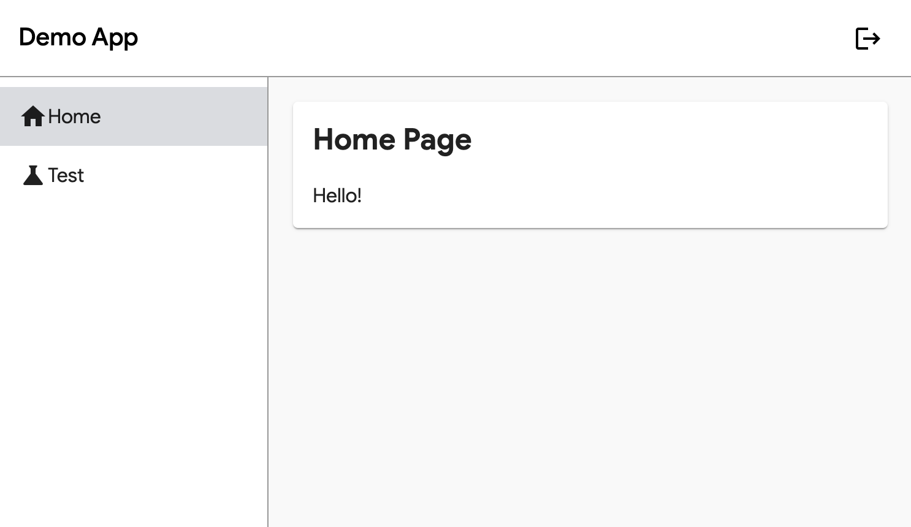

# Angular App using Go

The following repo shows how to embed an Angular application into a go server.



## Details

The ui directory was bootstrapped with the Angular CLI, `ng new ui` from root directory.

In order to serve the Angular build, the `embed.go` file was added to the ui directory to use the Go [embed](https://pkg.go.dev/embed) feature to bundle the static files into the Go binary. Then the files can be served directly using the [`http.FileServer`](https://pkg.go.dev/net/http#FileServer) functonality.

### embed.go

```go
package ui

import "embed"

//go:embed dist/*
var UI embed.FS
```

One caveat to allowing this to work without breaking on page reload/redirects, is to use a hash based router with Angular routing. To do this, the `useHash: true` option needs passed to the Angular router

### ui/src/app/app-routing.module.ts

```typescript
@NgModule({
  imports: [RouterModule.forRoot(routes, { useHash: true })],
  exports: [RouterModule],
})
export class AppRoutingModule {}
```

## Developer Workflow

Two consoles be can run to start the go server and the Angular development server to facilitate the frontend to server integration. Using the `ui/src/proxy.conf.json` file, all requests will be proxied from the localhost:4200/api domain to the localhost:8080 server to simulate a local devlopment service. This will allow hot reloading of the frontend application while having the existing backend services exposed.

```console
# console 1
go run cmd/server/main.go

# console 2
cd ui && npm start
```

## Docker

Use the following commands to package this app into a Docker container and run locally:

```console
docker build -t angular-go:latest .
docker run --rm -p 8080:8080/tcp angular-go:latest
```
